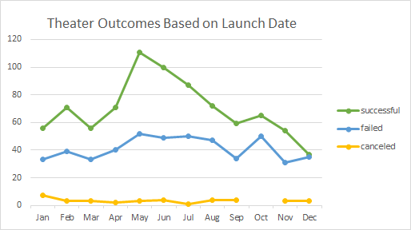
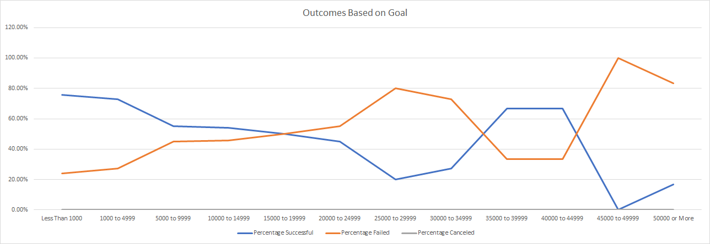

# kickstarter-analysis

## Overview of Project: 

### Create an Analysis to examine how different campaigns progressed vis-a-vis their launch dates and funding goals in order to evaluate the affectiveness of similar campaigns going forward. 

## Analysis and Challenges:

### In order to examine the different campaigns, I first created a Pivot table that allowed me to count all of the theater outcomes and the months that they launched. I used that Pivot Table to create a line chart that notes which months provide the most successful, failed and canceled launches of theater funding. The main challenge I see with the data in this set is that there are overall many more launches that occur in May than in December (more than double, in fact). This could make the data misleading and the data may benefit from a percentage-based analysis done over the months.

### Once I had considered the campaigns by launch date, I then created a table to review the plays by Goals. In order to compare them I used a range of goal amounts to gather the number of plays that were successful, failed and canceled within each range. After, I used the totals to calculate out the percentages and organized the percentages on a line chart. Which I used to chart the success, failure and cancellation percentages across the goal ranges.

## Results

### Based on the Outcomes by Launch Date there are two undeniable conclusions.
*  The most successful launches take place in May and June.
*  The least successful launches take place in December.
### Based on the Outcomes based on Goals one can conclude that once the the goal reaches $20,000 there is a much greater chance of failure.

The data provided is lacking duration of the campaigns which could factor greatly into it's success in reaching funding goals. this could be obtained by subtracting the launhced_at column from the deadline column and calculating the day duration. With this idea in mind, to create a duration chart explaining a plays success or failure in obtaining funding could help a great deal.

## In conclusion, the play Fever would probably benefit greatly by being launched in May with a low funding goal.
